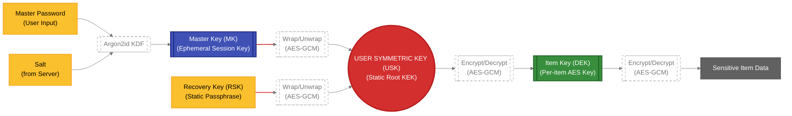
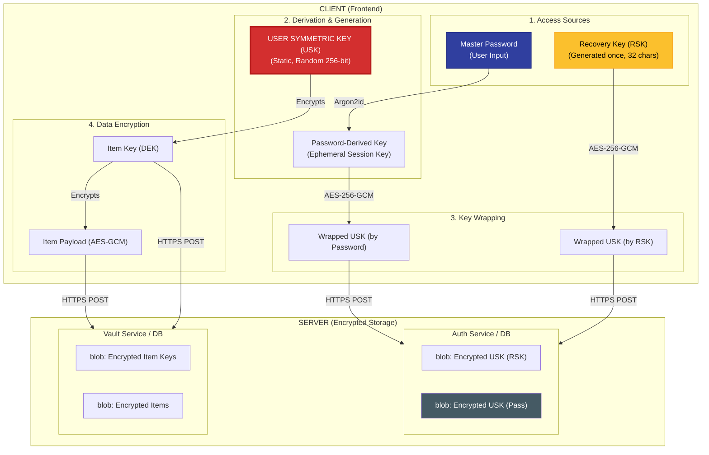
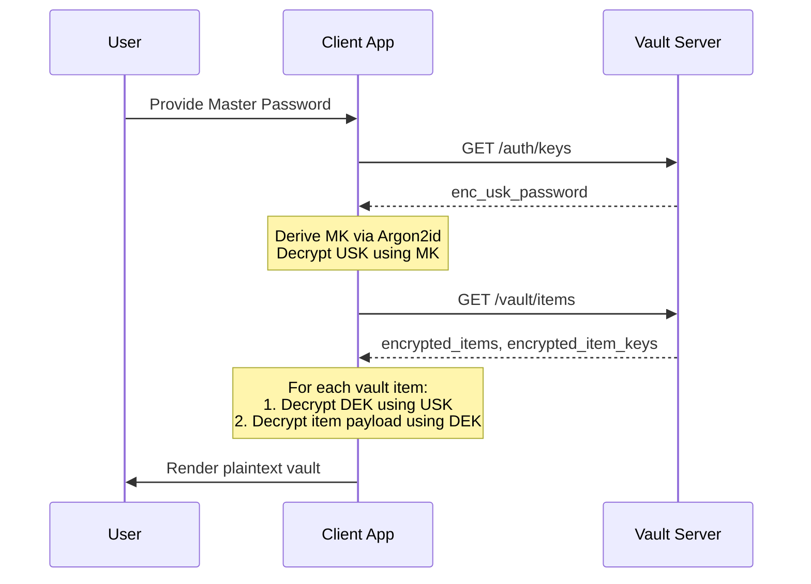
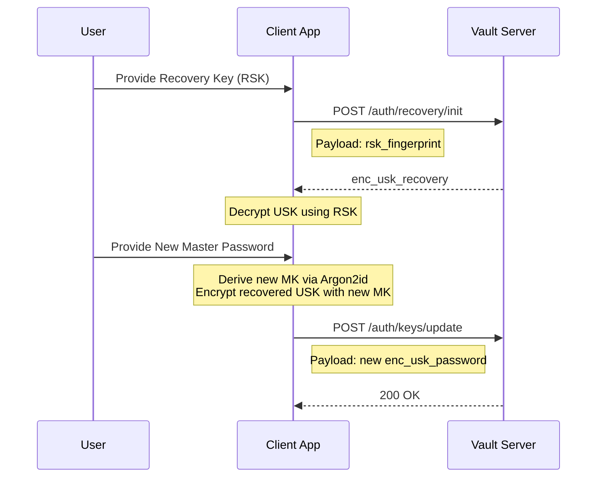
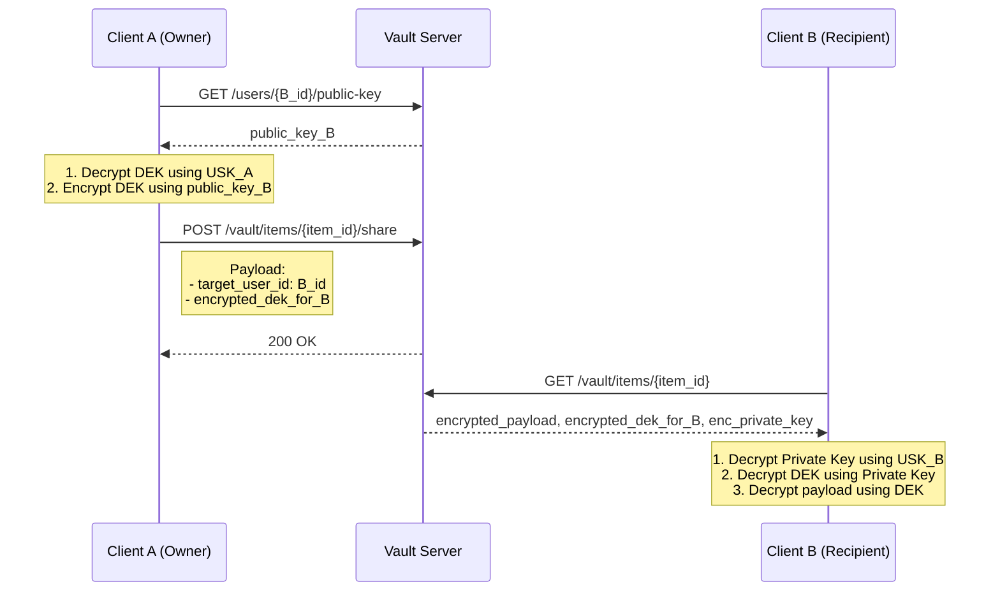

# [RFC-001] Zero-Knowledge Key Hierarchy and Derivation Protocol

---

| Metadata | Details                             |
| :--- |:----------------------------------------|
| **Document ID** | PSHD-ZKA-01                  |
| **Status** | `PROPOSED`                        |
| **Authors** | Patryk Krawczyk (@astrohack)     |
| **Created** | 2026-04-10                       |
| **Updated** | 2026-04-10                       |
| **Version** | 1.0.0                            |

---

## Abstract

This document specifies the cryptographic architecture, key management, and data model for a Zero-Knowledge (ZK) vault system. The protocol mandates client-side-only encryption using an **Envelope Encryption** and **Key Wrapping**. It enables secure password storage, metadata protection (`is_breached`, `entropy`, etc.), and account recovery without compromising the ZK principle.

---

## 1. Introduction

### 1.1 Design Principles
- **Zero-Knowledge:** The server MUST NOT have access to the USK or any plaintext secrets.
- **Client-Side Derivation:** All key derivation (KDF) MUST occur on the client.
- **Envelope Encryption:** Each item is encrypted with a unique Data Encryption Key (DEK).
- **Recovery:** Recovery keys MUST be independent of the Master Password.

---

## 2. Conventions and Terminology

The key words "MUST", "MUST NOT", "REQUIRED", "SHALL", "SHALL NOT", "SHOULD", "SHOULD NOT", "RECOMMENDED", "NOT RECOMMENDED", "MAY", and "OPTIONAL" in this document are to be interpreted as described in [RFC 2119](https://datatracker.ietf.org/doc/html/rfc2119).

### 2.1 Cryptographic Definitions
| Term | Definition |
| :--- | :--- |
| **Master Password** | High-entropy user secret; the source of truth for daily access. |
| **Master Key (MK)** | Ephemeral 256-bit key derived via **Argon2id**. Used solely to wrap/unwrap the USK. |
| **User Symmetric Key (USK)** | Permanent, random 256-bit root key. Acts as the **Key Encrypting Key (KEK)** for the entire vault. |
| **Recovery Key (RSK)** | Randomly generated 256-bit key, presented to the user as a mnemonic or Base32 string. |
| **Item Key (DEK)** | Random AES-256-GCM key unique to a single vault entry. |
| **AEAD** | Authenticated Encryption with Associated Data, specifically **AES-256-GCM**. |

---

## 3. Architecture Overview

### 3.1 Key Hierarchy


---

### 3.2. Cryptographic Primitives

All implementations MUST use:

| Primitive               | Algorithm                          | Parameters                  |
|-------------------------|------------------------------------|-----------------------------|
| Key Derivation          | Argon2id                           | -                           |
| Symmetric Encryption    | AES-256-GCM                        | 96-bit nonce, 128-bit tag   |
| Asymmetric Keys         | X25519 (preferred) or RSA-2048     | –                           |
| Hashing                 | SHA-256 / SHA-512                  | –                           |
| MAC / Integrity         | Included in AEAD                   | –                           |

---

## 4. Key Derivation


**Registration Flow (MUST):**
1. User enters **Master Password**.
2. Client derives **Master-Password-Derived Key (MK)** using Argon2id.
3. Client generates Random 256-bit as **User Symmetric Key (USK)** (`enc_usk_password`).
4. Client generates **asymmetric key pair (private_key + `public_key`)**.
5. Client generates a cryptographically secure random **Recovery Symmetric Key (RSK)** – 32 bytes (256 bits).
6. Client encrypts the **USK** using the **RSK** (AES-256-GCM) (`enc_usk_recovery`).
7. Client encrypts the user's **asymmetric private key** using the USK (`enc_private_key`).
8. Client displays the **Recovery Key (RSK)** to the user in a human-readable format (e.g. 32-character base58 or 4 groups of 8 characters) together with a QR code and a strong warning to store it securely offline.

Server receives and stores:
- `public_key` (plaintext)
- `enc_usk_password` (encrypted by MK)
- `enc_private_key` (encrypted by USK)
- `enc_usk_recovery` (encrypted by Recovery Key (RSK))
- `rsk_fingerprint` (RSK MUST be derived using Argon2id – used for verification)

### 4.3 Normal Operation (Daily Use)

- User provides Master Password.
- Client derives Master Key (MK) using Argon2id from Master Password.
- Client use MK to decrypt wrapped USK.
- USK is used to decrypt all `encrypted_item_key` values.
- All subsequent operations (decrypting items, custom fields including `meta_is_breached`, `meta_entropy`, `meta_semantic_category`) proceed as defined in Section 5.



### 4.4 Recovery Flow (Forgotten Master Password)

1. User provides the **Recovery Key (RSK)** (typed or scanned from QR).
2. Client generates `rsk_fingerprint` and server verifies it.
3. Client decrypts `enc_usk_recovery` using the provided RSK → obtains original USK.
4. With the recovered USK, client can decrypt all Item Keys and the entire vault content.
5. User is prompted to set a **new Master Password**.
6. Client derives a new USK from the new **MK**.
7. Client re-encrypts the old USK with the new USK.
8. (Optional but recommended) Client generates a **new Recovery Key (RSK)**, encrypts the new USK with it, and asks the user to store the new key.

After successful recovery, the old `enc_usk_recovery` may be replaced with a new one.



### 4.5 Database

The following fields SHOULD be present at `users` table:

| Column                  | Type | Nullable | Description                                                                         |
|:------------------------| :--- | :--- |:------------------------------------------------------------------------------------|
| **id**                  | `UUID` | No | Primary key. Unique identifier for the user.                                        |
| **email**               | `String` | No | Unique user identifier for authentication.                                          |
| **kdf_salt**            | `String` | No | Cryptographic salt used for Argon2id key derivation.                                |
| **kdf_params**          | `JSONB` | No | Configuration for KDF (iterations, memory, parallelism).                            |
| **enc_usk_password**    | `Blob/Text` | No | **USK** wrapped by the Password-Derived Key (AES-256-GCM).                          |
| **enc_usk_recovery**    | `Blob/Text` | No | **USK** wrapped by the **Recovery Key (RSK)** (AES-256-GCM).                        |
| **public_key**          | `Text` | No | User's public asymmetric key (RSA-2048 or X25519) in Base64.                        |
| **enc_private_key**     | `Blob/Text` | No | User's private asymmetric key, **encrypted by USK**.                                |
| **rsk_fingerprint**     | `String` | No | RSK derived using Argon2Id for verification without storage.                        |
| **rsk_fingerprint_salt** | `String` | No | Salt used to derive `rsk_fingerprint`                                               |
| **rsk_created_at**      | `Timestamp` | No | Audit timestamp of when the recovery key was generated.                             |

### 4.6 Security Considerations – Recovery Key (RSK)

- The Recovery Key **MUST** be generated with a cryptographically secure random number generator.
- The Recovery Key is **NEVER** sent to the server in plaintext.
- The server stores only the encrypted wrapper and a non-reversible fingerprint (derived using Argon2Id with salt).
- Users **MUST** be strongly warned to store the Recovery Key in a safe, offline location (e.g. printed Emergency Kit, password manager backup, physical safe).
- After using the Recovery Key, it is **RECOMMENDED** to generate and store a new one (key rotation).
- Compromise of the Recovery Key alone does not grant access without the encrypted vault data.

---


## 5. Item Encryption (Create / Update)

**Per-Item Encryption (REQUIRED):**

1. Client generates fresh random **Item Key** (32 bytes).
2. Client encrypts **all sensitive data** with Item Key using AES-256-GCM:
    - login
    - password
    - notes
    - **all custom field values** (`meta_is_breached`, `meta_entropy`, `meta_semantic_category`, etc.)
3. Client includes **Associated Data (AD)** in AEAD:
    - `item_id|user_id|field_name|revision_timestamp`
4. Client encrypts the Item Key itself with USK → `encrypted_item_key`.
5. Client sends to Vault Service only:
    - `encrypted_item_key`
    - `encrypted_data`
    - plaintext structural metadata (`folder_id`, `is_favorite`, timestamps)

Server **NEVER** receives plaintext or Item Key in the clear.

---

## 6. Custom Fields and Metadata Encryption

All custom fields **MUST** be encrypted exactly like the password:

- Field `name` (e.g. `meta_is_breached`) → stored in plaintext (for UI filtering).
- Field `value` → encrypted with the Item Key (AEAD).
- Supported types: Text, Hidden, Boolean.

**Recommended prefix convention:**
- `meta_is_breached`
- `meta_entropy`
- `meta_semantic_category`
- `meta_last_hibp_check`

---

## 7. Single-Item Sharing

**Sharing Protocol (MUST implement):**

1. Owner (A) requests sharing with user B.
2. Client A:
    - Decrypts Item Key locally using own USK.
    - Fetches B’s `public_key`.
    - Re-encrypts the **same Item Key** with B’s public key (asymmetric).
3. Server stores additional record: e.g. `shared_item_key_for_b` (encrypted with B’s public key).
4. User B:
    - Decrypts shared Item Key with own private key (decrypted by B’s USK).
    - Decrypts item data normally.

No re-encryption of the entire item is required.



---

## 8. Database Schema (Summary)

See Section 10 of the companion document “SPM-ZKAI Database Schema” for full PostgreSQL schema with four schemas: `vault`, `security`, `audit`, `ai`.

Key tables:
- `vault.items` – `encrypted_item_key`, `encrypted_data`
- `vault.item_custom_fields` – encrypted `value`
- `security.breach_events`
- `audit.audit_logs`
- `ai.recommendations`

---

## 9. Security Considerations

- Server compromise yields only ciphertext.
- Per-item keys limit blast radius.
- AEAD prevents cut-and-paste attacks.
- Asymmetric sharing prevents key reuse.
- Audit log is immutable and tamper-evident.
- All custom metadata (`is_breached`, `entropy`, etc.) is encrypted.

---

## 10. References

- Bitwarden Security Whitepaper (2024)
- RFC 8446 (TLS 1.3)
- RFC 5869 (HKDF)
- Argon2 Specification (RFC 9106)
- NIST SP 800-63B

---

**Appendix A – Example JSON Item Structure (after client encryption)**

```json
{
  "id": "uuid",
  "encrypted_item_key": "2.aes256-gcm|...|...",
  "encrypted_data": "2.aes256-gcm|...|...",
  "folder_id": "uuid",
  "custom_fields": [
    { "name": "meta_is_breached", "value": "2.aes256-gcm|...|..." }
  ]
}
```
**Appendix B – Recovery Key Display Example**
```
Your Recovery Key (store this safely!):

X7K9-P4M2-Q8V6-L3N1-R9T5-B2H7-J4W8-F6G3

This key allows full vault recovery if you forget your Master Password.
It will NOT be shown again.
```
