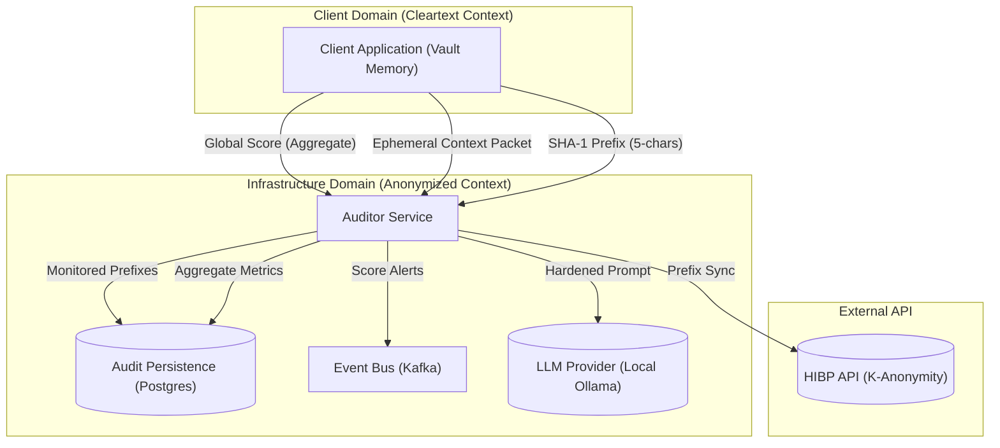
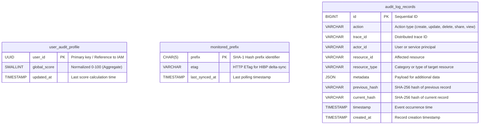
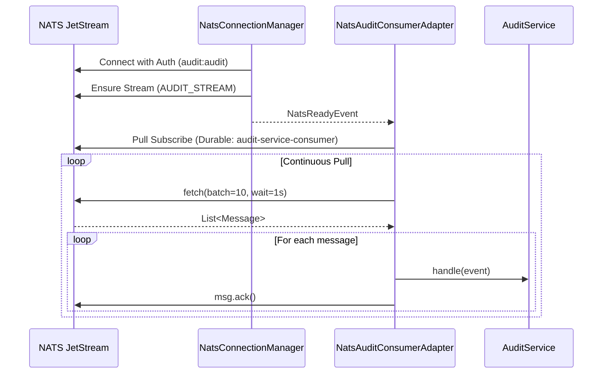

# [RFC-003] Security Audit and AI Advisor Protocol Specification

---

| Metadata | Details |
| :--- | :--- |
| **Doc ID** | PSHD-SEC-03 |
| **Status** | `PROPOSED` |
| **Authors** | Patryk Krawczyk (@astrohack) |
| **Created** | 2026-04-10 |
| **Updated** | 2026-04-11 |
| **Version** | 1.0.0 |

---

## 1. Introduction

### 1.1 Motivation

Modern password management requires proactive security analysis to combat credential stuffing and service-level breaches. However, traditional auditing systems often compromise user privacy by transmitting vault metadata to central servers or third-party Large Language Models (LLMs). This document provides a framework for performing high-fidelity security audits and AI-driven recommendations while maintaining complete end-to-end encryption.

### 1.2 Scope

This specification covers the interaction between the client application, the Auditor microservice, and external providers for breach detection and semantic analysis. It includes the definition of anonymized data structures, k-anonymity lookup patterns, and deterministic blind indexing.

---

## 2. Conventions and Terminology

The key words "MUST", "MUST NOT", "REQUIRED", "SHALL", "SHALL NOT", "SHOULD", "SHOULD NOT", "RECOMMENDED", "NOT RECOMMENDED", "MAY", and "OPTIONAL" in this document are to be interpreted as described in [RFC 2119](https://datatracker.ietf.org/doc/html/rfc2119).

### 2.1 Glossary

| Acronym | Name | Description |
| :--- | :--- | :--- |
| **ZKA** | Zero-Knowledge Architecture | A design principle where the server possesses zero access to plaintext user secrets or cryptographic materials capable of decrypting them. |
| **USK** | User Symmetric Key | The root AES-256 key derived on the client from the Master Password, used as the primary Key Encrypting Key (KEK). |
| **KLDP** | K-Anonymity Leak Detection Protocol | A mechanism for querying breached credential databases without revealing the target hash. |
| **BDDP** | Blind-Indexing Duplicate Detection Protocol | A technique for identifying identical records across encrypted datasets using keyed hashes. |
| **SBBP** | Service-level Breach Broadcasting Protocol | A probabilistic method for notifying users of platform-wide compromises using Bloom filters. |
| **TPGP** | Themed Passphrase Generation Protocol | A flow for generating high-entropy passphrases based on semantic keyword expansion. |
| **DEK** | Data Encryption Key | A unique, per-item symmetric key used to encrypt individual vault records. |
---

## 3. Cryptographic Primitives

All implementations of the protocols defined in this document MUST adhere to the following primitive specifications:

| Primitive | Algorithm | Parameters |
| :--- | :--- | :--- |
| **Symmetric Encryption** | AES-256-GCM | 96-bit nonce, 128-bit tag |
| **Keyed Hashing (MAC)** | HMAC-SHA256 | 256-bit key (USSP) |
| **Cryptographic Hashing** | SHA-256 | Standard 32-byte output |
| **K-Anonymity Hashing** | SHA-1 | First 5 hexadecimal characters used as prefix |
| **Probabilistic Filters** | Bloom Filter | Configured for < 0.1% False Positive Rate |

---

## 4. Architecture Overview

The system architecture utilizes a Hexagonal pattern to decouple core logic from external intelligence feeds. All communication between the client and the Auditor service MUST be authenticated and encrypted via TLS 1.3.



---

## 5. Protocol Flows

### 5.1 KLDP - K-Anonymity Leak Detection Protocol

Facilitates secure credential exposure verification without leaking plaintext passwords or full hashes to the server.

1. Client computes the SHA-1 hash of the plaintext password.
2. Client extracts the first 5 hexadecimal characters as the `k_anonymity_prefix`.
3. Client transmits the prefix to the Auditor service to request a suffix update.
4. Auditor service checks the `monitored_prefix` global cache for existing entries.
5. If the cache is stale or missing, the Auditor service fetches the full list of suffixes from the external HIBP provider and updates the global cache.
6. Auditor service returns the list of suffixes to the Client without persisting the relationship between the prefix and the specific User or Record.
7. Client performs a local binary search for the remaining 35 characters of its SHA-1 hash within the returned suffix list.
8. If a match is discovered, the Client updates the encrypted `meta_is_breached` custom field within its own vault record.

### 5.2 BDDP - Blind-Indexing Duplicate Detection Protocol

Identifies identical passwords across the vault locally to prevent server-side leakage of password relationships.

1. Client scans its decrypted vault items locally.
2. Client identifies items sharing identical plaintext passwords.
3. Client calculates its own `uniqueness_ratio` based on these local matches.
4. Client updates its own encrypted `meta_uniqueness` metadata fields.
5. The infrastructure layer (Auditor Service) SHALL NOT receive or store any keyed hashes or indexing tokens that would enable cross-record correlation.

### 5.3 SPSP - Security Posture Scoring Protocol

Quantifies the overall cryptographic health of a vault by aggregating weighted risk signals locally.

1. Client aggregates metrics from its decrypted vault items (e.g., entropy, breach status, uniqueness).
2. Client applies a weighted formula to calculate the `global_score` (0-100).
3. Client transmits the final `global_score` (and optional anonymized aggregate statistics) to the Auditor service.
4. Auditor service persists the `global_score` in the `user_audit_profile` table for display and history tracking.
5. The raw metrics for individual items MUST NOT be shared with or stored on the server.

### 5.4 FLOW-04 PASA - Private AI Security Advisor

Generates context-aware security remediation advice using local LLM execution on sanitized, ephemeral metadata packets.

1. Client generates a sanitized JSON context packet containing non-identifiable metrics (e.g., entropy=2, is_breached=true, category="Finance") for a specific item.
2. Client strips all record IDs and PII before transmission.
3. Client transmits the ephemeral context packet to the Auditor service as a one-time recommendation request.
4. Server enforces length boundaries (`MAX_BYTES=256`) on semantic fields to prevent prompt expansion attacks.
5. Server injects the sanitized context into a hardened prompt template and routes it to the local LLM.
6. Server returns the `AdvisoryReport` JSON object to the Client and immediately purges the context packet from memory.

AI Advisor **MUST NOT** ever receive plaintext passwords.

**Allowed data flow:**
- Client decrypts only necessary metadata locally.
- Client sends **anonymized metadata** to AI Service:
  - `entropy`, `is_breached`, `semanticCategory`, `reused`, `length`, `last_changed`
- AI Service returns recommendations (JSON).

AI may run locally (Ollama) or remotely (Groq/Llama) – both variants are compliant.

---

### 5.5 SBBP - Service-level Breach Broadcasting Protocol

Notifies users of service-level platform compromises via probabilistic filters to minimize domain metadata leakage.

1. Auditor service maintains a global repository of compromised service domains.
2. Auditor service generates a Bloom filter representing the set of compromised domains.
3. Client fetches the latest Bloom filter during the synchronization phase.
4. Client checks its local decrypted list of domains against the Bloom filter.
5. If a hit occurs, the Client performs a secondary validation against a specific exact-match endpoint or local list to eliminate false positives.
6. Client notifies the user if a service-level hazard is confirmed.

### 5.6 ASBR - AI Semantic Blast Radius

Identifies cascading vulnerabilities by mapping dependencies between high-impact "Hub" accounts and dependent "Spoke" services.

1. LLM identifies "Hub" accounts (e.g., primary email providers) based on record semantic categories.
2. LLM maps dependencies between items (e.g., services using the primary email for recovery).
3. If a "Hub" account is detected as breached, the system elevates the risk status for all dependent "Spoke" accounts.
4. The system prioritizes recovery and rotation instructions in the `AdvisoryReport` based on this propagated risk.

### 5.7 BARP - Behavioral AI Risk Persona

Optimizes the urgency and tone of security advisories by measuring the latency between hazard detection and user resolution.

1. Auditor service tracks the delta between the timestamp of a detected hazard and the timestamp of vault remediation.
2. Auditor service computes the `RemediationLatency` statistics for the user.
3. System assigns a risk persona based on latency (e.g., "Proactive", "Reactive", or "Negligent").
4. LLM adjusts the tone of the generated advice (EDUCATIONAL, DIRECTIVE, or URGENT) based on the assigned persona to mitigate alert fatigue.

### 5.8 TEAL - Tamper-Evident Audit Logging

Ensures non-repudiation and traceability of all cross-service actions via a cryptographically linked chain of records.

1. Microservices (e.g., Vault, IAM) publish state-change events (`CREATE`, `UPDATE`, `DELETE`, `SHARE`, `VIEW_ITEM`) to the NATS message broker (`audit.events.*` subject).
2. Events MUST include a `X-Trace-Id` header to track the entire request chain across services. This is critical for forensic debugging.
3. The Auditor service consumes the event and fetches the `current_hash` of the latest audit log record (using a zeroed hash for the genesis record).
4. The service computes a new SHA-256 hash using the `previous_hash` concatenated with the new event attributes.
5. The Auditor persists the event alongside the `previous_hash` and `current_hash`, establishing a tamper-evident, verifiable log.

### 5.9 TPGP - Themed Passphrase Generation Protocol

Enables the generation of high-entropy, memorable passphrases based on user-defined semantic themes using LLM keyword expansion.

1. **Client Request**: User provides a semantic theme (e.g., "Deep Sea", "Sci-Fi", "Ancient Rome") via the Client.
2. **Theme Transmission**: Client transmits the theme string to the Auditor service.
3. **LLM Expansion**: Auditor service routes the theme to the local LLM with a directive to generate a set of $N$ (default $N=12$) distinct, relevant keywords.
4. **Keyword Return**: Auditor service returns the raw list of keywords to the Client and purges the request from memory.
5. **Local Composition**: Client randomly selects a subset of keywords (e.g., 3-4) from the received set.
6. **Passphrase Assembly**: Client joins the selected keywords using a secure separator (e.g., `-` or `_`) and presents the final passphrase to the user.

**Security Constraints:**
- The Auditor service **MUST NOT** participate in the selection or assembly of the final passphrase to prevent pre-computation or brute-force optimization attacks.
- LLM response MUST be sanitized to ensure only alphanumeric keywords are returned.


---

## 6. Data Model Specification

### 6.1 Entity Relationship Diagram

The Auditor service MUST persist metrics in a PostgreSQL relational database according to the following entity relationship model. This model ensures that no individual record metrics or plaintext metadata are stored on the server.



---

## 7. Operational Interfaces

### 7.1 Event-Driven Synchronization

Inter-service communication SHALL follow the CloudEvents specification for asynchronous updates.

1. **com.passshield.vault.item.mutated**: Triggered when a vault entry is created or updated, prompting a re-audit.
2. **com.passshield.iam.mfa.updated**: Triggered when a user's MFA status changes, affecting the `global_score`.
3. **com.passshield.audit.score.critical**: Emitted when a user's security posture falls below a predefined threshold (e.g., < 30).


#### 7.1.1 NATS Connector Architecture



#### 7.1.2 Tamper-Evident Audit Events
The Auditor service consumes the following events from the `audit.events.*` NATS subject to construct the immutable log:

- **audit.events.create**: Emitted when a new resource is created (e.g., vault item, folder, IAM identity).
- **audit.events.update**: Emitted when an existing resource's metadata or ciphertext is modified.
- **audit.events.delete**: Emitted when a resource is permanently deleted.
- **audit.events.share**: Emitted when a vault item or folder is shared with another entity.
- **audit.events.view**: Emitted when a highly sensitive resource is decrypted and accessed.
- **audit.events.raw**: Custom events for any other audit purposes, as long as they include required fields and `metadata`.

#### Event structure:

| Field | Type | Description |
| :--- | :--- | :--- |
| `eventId` | UUID | Unique identifier for the event. |
| `version` | String | Schema version of the event payload (currently "1.0"). |
| `tenantId` | String | Tenant ID for multi-tenancy data isolation. (currently not supported) |
| `actorId` | String | ID of the user or system component performing the action. |
| `action` | String | The operation performed, ideally in a `namespace.verb` format (e.g., `secret.create`). |
| `status` | String | Outcome of the event (e.g., `SUCCESS`, `FAILURE`, `DENIED`). |
| `resourceId` | String | Unique identifier of the target resource being accessed or modified. |
| `resourceType` | String | Category or type of the target resource (e.g., `secret`, `vault`). |
| `timestamp` | Long | Event occurrence time in Unix Epoch milliseconds. |
| `traceId` | String | OTEL trace ID. (optional) |
| `metadata` | JSON Object | Payload for additional data. |

#### Optional example metadata embedded fields:
| Field | Type | Description |
| :--- | :--- | :--- |
| `ip` | String | The IP address of the client that initiated the request. |
| `userAgent` | String | The full User-Agent string of the client browser or application. |
| `clientType` | String | The type of client app used (e.g., `web`, `mobile`, `extension`, `desktop`). |
| `failureReason` | String | Error code or machine-readable reason if status is `FAILURE` or `DENIED` (e.g., `invalid_mfa`, `expired_session`). |

### 7.2 Resilience Controls

1. **Circuit Breakers**: External integrations (HIBP, LLM) MUST trigger an open state if the error rate exceeds 20% over a rolling 30-second window.
2. **Rate Limiting**: The system SHALL enforce a limit of 100 requests per second (RPS) per user to prevent resource exhaustion.

---

## 8. Security Considerations

### 8.1 Zero-Knowledge Integrity

The Auditor service SHALL NOT receive plaintext passwords, encrypted vault records, or deterministic metadata (e.g., Blind Indexes). All analysis MUST be conducted locally by the Client. The infrastructure layer handles only:
1. Global hash prefix data for HIBP synchronization.
2. Ephemeral, non-identifiable context packets for AI recommendations (purged after response).
3. Final aggregate health scores.

### 8.2 Probability of False Positives

The SBBP utilizes Bloom filters which inherently support false positives. Clients MUST implement defensive checks to ensure users are not prompted to rotate passwords for services that were not actually breached.

### 8.3 Prompt Injection Mitigation

Inputs to the PASA module MUST be validated against a whitelist of expected semantic categories. User-provided strings MUST be escaped and truncated to prevent adversarial influence over the LLM's directive output.

---

## 9. References

1. RFC 2119: Key words for use in RFCs to Indicate Requirement Levels.
2. RFC 8174: Ambiguity of Uppercase vs Lowercase in RFC 2119.
3. NIST SP 800-63B: Digital Identity Guidelines.
4. Argon2 Password Hashing Competition (KDF Specification).

---

## Appendix A: Example Advisory JSON

```json
{
  "user_id": "u-12345",
  "global_score": 42,
  "advisories": [
    {
      "priority": "CRITICAL",
      "category": "BREACH",
      "record_id": "r-67890",
      "message": "Security hazard detected: Your 'Finance' login was found in a recent leak. Immediate rotation is required."
    },
    {
      "priority": "HIGH",
      "category": "REUSE",
      "message": "Six records share an identical password. This increases the cascading risk of your vault."
    }
  ],
  "persona": "REACTIVE"
}
```
